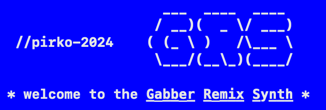

# Synth Song

## Main focus

With this project I put the focus on synthesis. In the beginning by making wave-table oscillators and then later envelopes for amplitude and pitch. My favorite synth is the kick synth which I could make using a pitch envelope and the hyperbolic tangent function for soft-clipping.

## Process

I started off wanting to make a playable synthesizer, through the keyboard or MIDI.

## Reflection