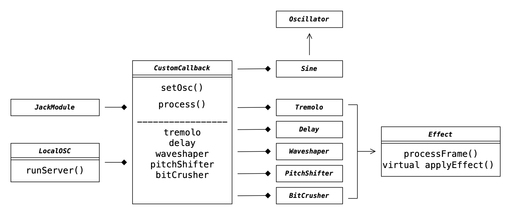
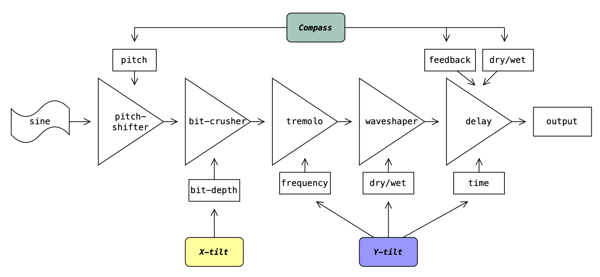
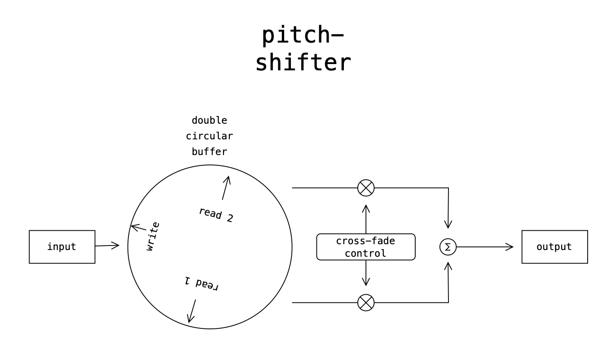

# Alien camera

Vervremende interactie door onconventionele aansturing.

## Conceptueel ontwerp

We hebben ons concept bedacht vanuit een autonoom ontwerpkader. Ons doel is om het publiek uit te dagen om met ons systeem te interacteren. Dit willen we bereiken door onconventionele aansturing toe te passen, waardoor het publiek een vervreemde ervaring krijgt.

De basis van de onconventionele aansturing is dat in plaats van dat het geluid het beeld beïnvloedt, het beeld het geluid beïnvloedt.

## Technisch ontwerp

### Aansturing

Onze aansturing begint bij de telefoon-app _ZIG SIM_. Hier worden de **compass**-, **gravity-X**- en **gravity-Y**-waarden van de telefoon via OSC naar een Max-patch gestuurd. Deze Max-patch schaalt de inkomende OSC-berichten en stuurt deze berichten door naar het OSC-object in ons C++ project. Ten slotte worden deze inkomende berichten gemapt naar verschillende parameters van onze effecten. Bovendien worden er OSC-berichten gestuurd naar het programma _Resolume_ om de video-effecten daar aan te sturen.

### Class diagram

### Audio diagram

### Pitch-shifter diagram

## Tijdsbesteding

### Pier schatting urenoverzicht

- OSC werkend krijgen: _10 uur_
- Bug fixing: _10 uur_
- Concept brainstormen: _3 uur_
- Bestaande effecten aanpassen: _5 uur_

Totale tijdsbesteding: **28 uur**

### Roman-James schatting urenoverzicht

- Concept brainstormen: _3 uur_
- openCV: _5 uur_
- OSC naar effecten mappen: _10 uur_
- Bug fixing: _10 uur_
- OSC naar visuals mappen: _2 uur_

Totale tijdsbesteding: **30 uur**

## Reflectie

### _Pier:_

Aan het begin van het project vond ik het lastig om aan het concept te werken zonder tests uit te kunnen voeren, eigenlijk begon het pas leuk te worden toen we de OSC werkend kregen en zelf een beetje konden itereren. Werken met Roman-James vond ik heel goed gaan aangezien hij net ideeën toe kon voegen wanneer ik minder gemotiveerd werd en andersom. 

Een paar takeaways zijn:

- Eerder beginnen met testen en minder theoretisch de interactie bedenken.
- Iemand hebben om mee te sparren is heel fijn met coderen.

### _Roman-James:_

Mijn ervaring met Pier samenwerken was super prettig; ik vond het heel motiverend om iemand te hebben die me verantwoordelijk hield en ik denk dat we samen een veel vetter eindproduct hebben gemaakt dan als we solo zouden werken. Ook was het heel relaxed om samen problemen te kunnen oplossen en iemand te hebben die je vragen kan stellen als je vastloopt. 

Een paar takeaways zijn:

- Een goed conceptueel ontwerp is belangrijk voor de artistieke zeggingskracht.
- Een duidelijk conceptueel ontwerp kan je heel fijn helpen bij het maken van keuzes tijdens het bouwen van je systeem.
- Voor mij werkt samenwerken erg goed.
- Zo snel mogelijk prototypen maakt het eindproduct beter.
