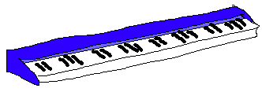

# Absurdistische piano

Een instrument dat met je mee speelt. Af en toe klink het goed af en toe gaat 'ie ¯\\\_(ツ)_/¯.

## Het hoofddoel van het project

Het hoofddoel van dit project is het creëren van een prototype van een hardware- of software-synthpiano. Bij voorkeur een plug-and-play hardware-synthpiano die zelfstandig kan werken. Het instrument moet leuk zijn om te bespelen.

## Vier leerdoelen

1. Meer werken met playtesting.
2. Het liefst leren werken met embedded C++.
3. Een overzichtelijk project maken waar ik lang aan zou kunnen werken.
4. Een creatief maar toch technologisch interessant project maken.

## Voor wie?

Dit instrument is bedoeld voor muzikanten die iets nieuws willen toevoegen aan hun improvisatiepraktijk. Het moet plug-and-play zijn voor korte improvisatiesessies en recreatief gebruik.

## Project planning

1. Idee bedenken.
2. Idee uitwerken, kiezen hardware/ software.
3. Technologie beginnen uit te zoeken/ hardware vinden.
4. Eerste features programmeren.
5. Playtesten/ troubleshooten.
6. Toevoegen extra features.
7. Playtesten/ werken aan opmaak/ case.
8. Presentatie.

## Eindoplevering

Werkende hardware synth-piano met behulp van een microcontroller.

### _of_

Website of programma dat op basis van MIDI input werkt. Deze website of programma zou een prototype kunnen zijn voor een uiteindelijke hardware synth.
